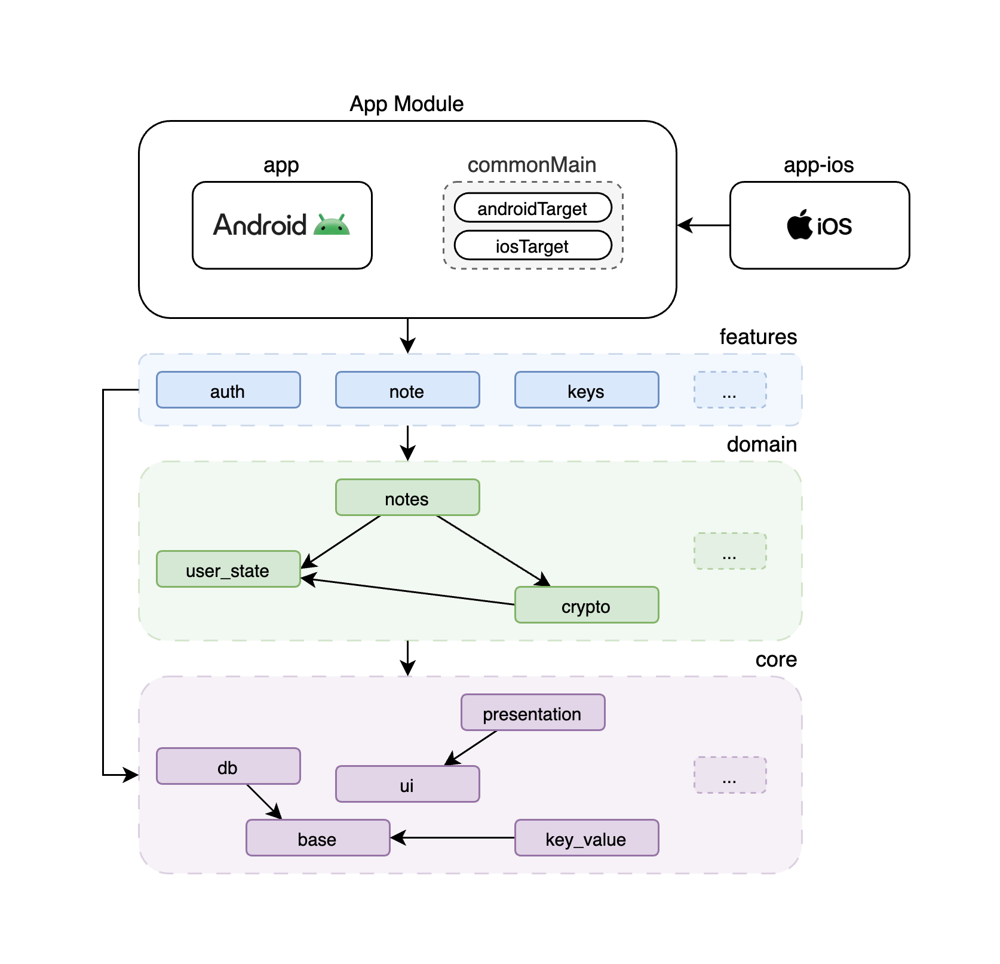
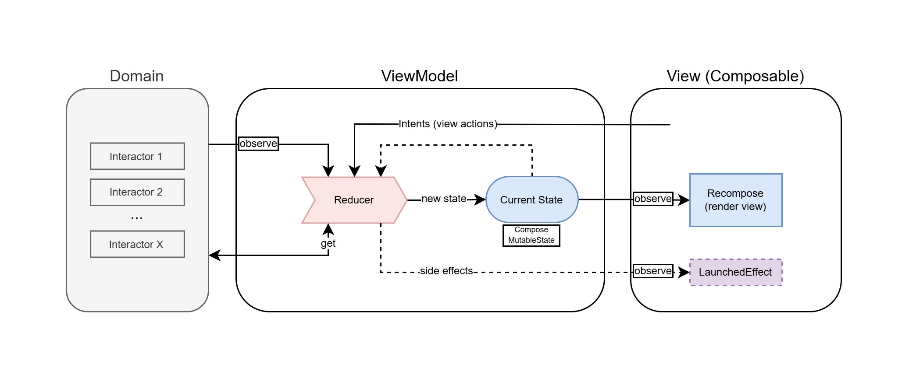
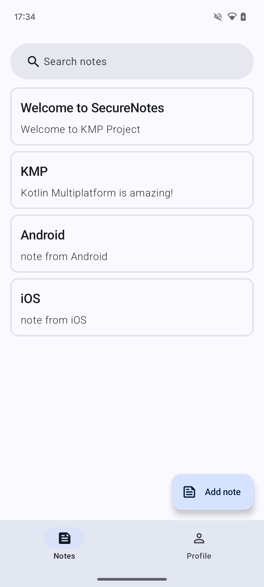
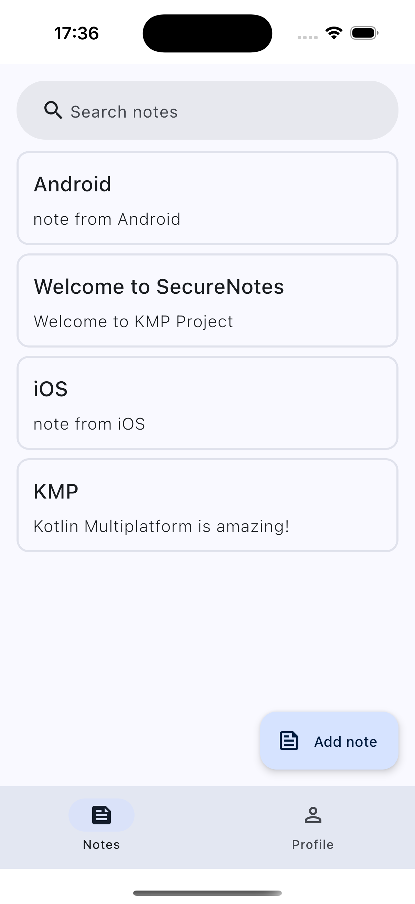

# SecureNotes - KMP Mobile App

SecureNotes is a simple notes app that can be used on both Android and iOS platforms.

All data is encrypted and synced with the Cloud Firestore. Only the owner of the note can decrypt it.

## Project Tech Stack

SecureNotes is a KMP project with completely shared code base across Android and iOS platforms. The application UI is based on Compose Material3.

- [Compose Multiplatform](https://github.com/JetBrains/compose-multiplatform) - shared UI
- [Compose ViewModel](https://www.jetbrains.com/help/kotlin-multiplatform-dev/compose-viewmodel.html) - shared ViewModel
- [Room Database](https://developer.android.com/kotlin/multiplatform/room) - DB abstraction layer over SQLite
- [Data Store](https://developer.android.com/jetpack/androidx/releases/datastore) - key-value storage for non-secret data
- [KVault](https://github.com/Liftric/KVault) - encrypted key-value storage for secret data
- [Koin](https://github.com/InsertKoinIO/koin) - DI Framework
- [Kotlinx Serialization](https://github.com/Kotlin/kotlinx.serialization) - JSON serialization
- [Navigation Compose](https://www.jetbrains.com/help/kotlin-multiplatform-dev/compose-navigation-routing.html) - Compose Multiplatform adaptation for KMP
- [Napier](https://github.com/AAkira/Napier) - Logger for KMP
- [Libdosium](https://github.com/ionspin/kotlin-multiplatform-libsodium) - data encryption with Libsodium for KMP.

## Global Project Architecture

Android and iOS applications implements its own base initialization point:

- app for Android
- app-ios for iOS

These initialization points create a global UI controller and a dependency graph. These main things are implemented in the App module.

SecureNotes is a multi-module project: the App module depends on the Feature, Domain, and Core modules.

Feature modules cannot depend on each other.

Domain modules can depend on each other. These dependencies are built hierarchically.

Core modules can also depend on each other. These dependencies are determined by how commonly used they are.

## Presentational Architecture

The project's presentational architecture is a simplified version of MVI.

The ViewModel is the central element of the architecture. It contains the declarative state that is updated through its reducer. It receives signals (intents) from the View. It observes the domain state.

The declarative state of the ViewModel is implemented as a composable MutableState. The Composable View observes this state and recomposes whenever it changes.

## Backend

SecureNotes uses FastAPI [Backend](https://github.com/aspoliakov/securenotes-backend).

## Screenshots

Android/iOS

 

## Author

The project SecureNotes is developed and maintained by Anton Poliakov.
