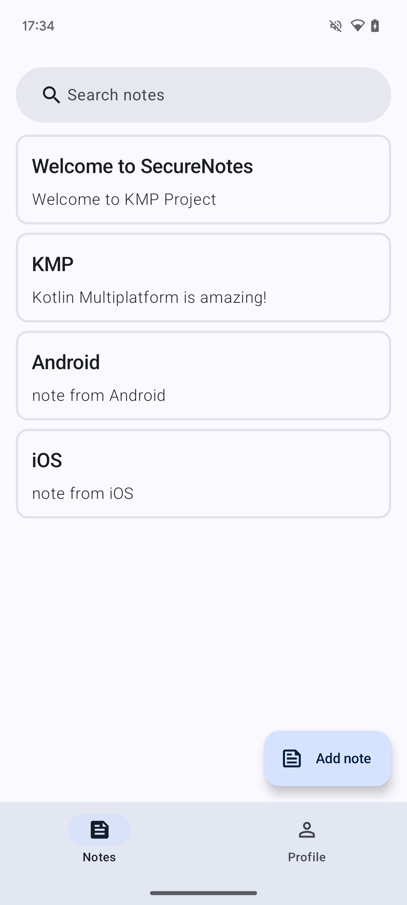
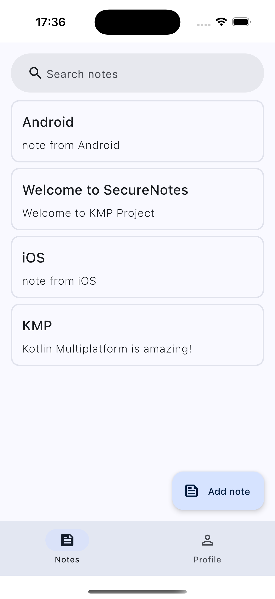

# SecureNotes - KMP Mobile App

A KMP project for a simple Notes app using data encryption and Firestore as a backend.

## Project tech stack

The project has a completely common code base for Android and iOS both domain and UI. The application UI is based on Compose Material3.

- [Compose Multiplatform](https://github.com/JetBrains/compose-multiplatform) - shared UI
- [Room Database](https://developer.android.com/kotlin/multiplatform/room) - DB abstraction layer over SQLite
- [Data Store](https://developer.android.com/jetpack/androidx/releases/datastore) - key-value storage for non-secret data
- [KVault](https://github.com/Liftric/KVault) - encrypted key-value storage for secret data
- [Koin](https://github.com/InsertKoinIO/koin) - DI Framework
- [Firebase](https://github.com/GitLiveApp/firebase-kotlin-sdk) - Kotlin-first SDK for Firebase
- [Kotlinx Serialization](https://github.com/Kotlin/kotlinx.serialization) - JSON serialization
- [Navigation Compose](https://www.jetbrains.com/help/kotlin-multiplatform-dev/compose-navigation-routing.html) - Compose Multiplatform adaptation for KMP
- [Napier](https://github.com/AAkira/Napier) - Logger for KMP
- [Libdosium](https://github.com/ionspin/kotlin-multiplatform-libsodium) - data encryption with Libsodium for KMP.

## Global project architecture

Android and iOS applications implements its own base initialization point:

- app for Android
- app-ios for iOS

These initialization points create a global UI controller and a dependency graph. These main things are implemented in the App module.

SecureNotes is a multi-module project: the App module depends on the Feature, Domain, and Core modules.

Feature modules cannot depend on each other.

Domain modules can depend on each other. These dependencies are built hierarchically.

Core modules can also depend on each other. These dependencies are determined by how commonly used they are.

## Presentation architecture

## Firestore backend

## Screenshots

Android

iOS

## License
